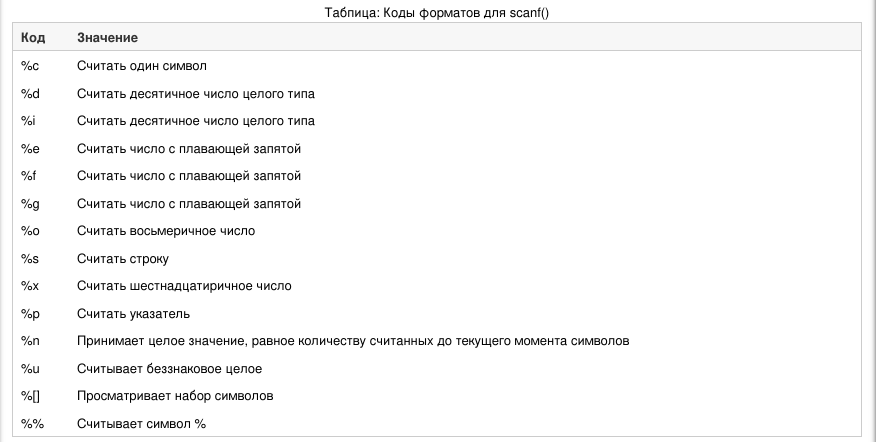
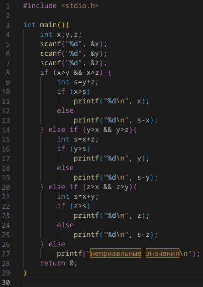
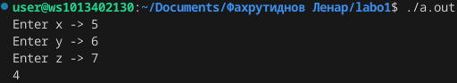
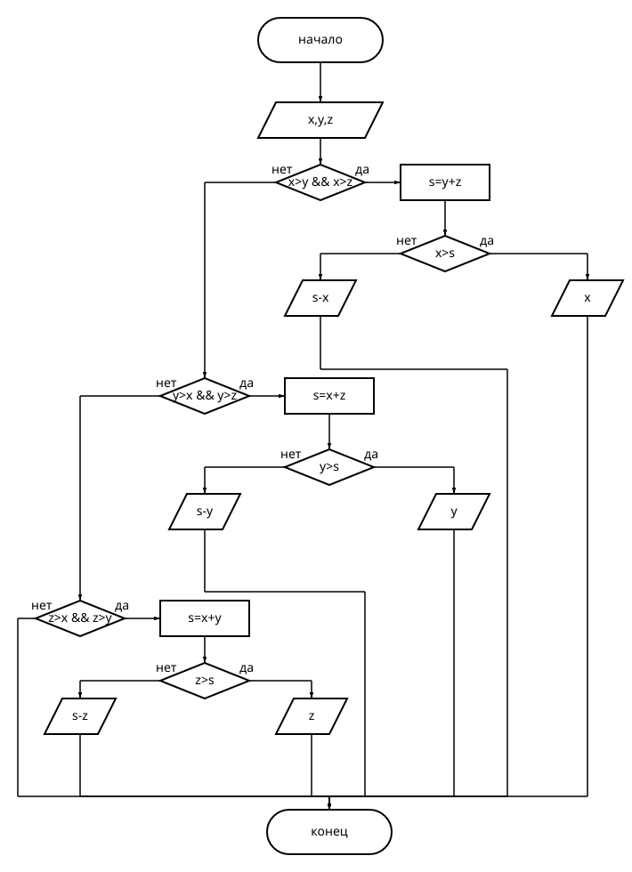

# Лабороторная работа №1 | 2-ой варинат
## Задание
 Вывести значение наибольшего из трёх параметров x, y, z если оно больше суммы двух других параметров, и разность этой суммы и наибольшего значения иначе.

## Полезно в будущем 
Полезная таблица для ``scanf``

## Код программы 

### Рузльтат ее работы

## Блок схема

## Инстуркция 
1. В терминалие **VSC** напсиать команду ``./a.out``
2. В случае если не работает написать команды ``gcc hello.c`` => ``./a.out``

## Использованные источники
https://www.c-cpp.ru/content/scanf
https://programforyou.ru/block-diagram-redactor
https://skillbox.ru/media/code/yazyk-razmetki-markdown-shpargalka-po-sintaksisu-s-primerami/

